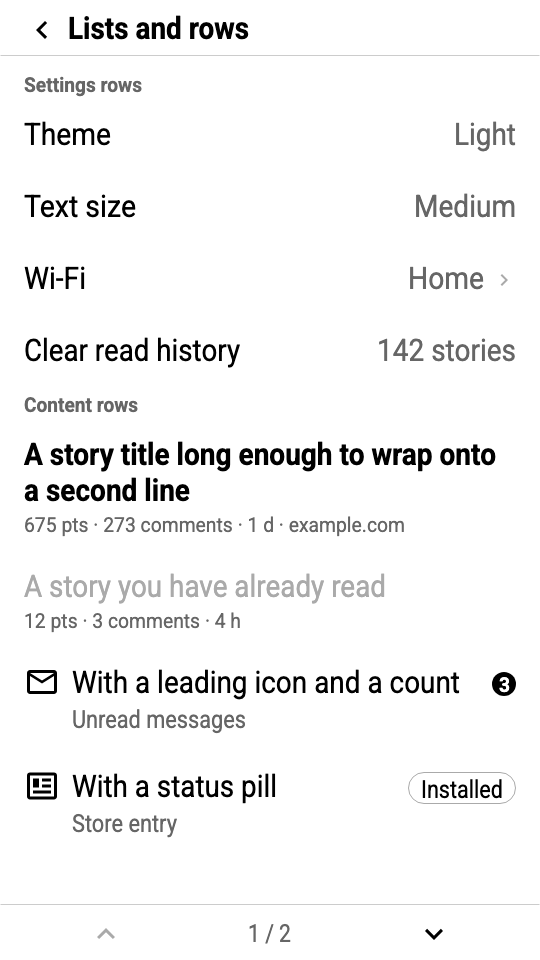
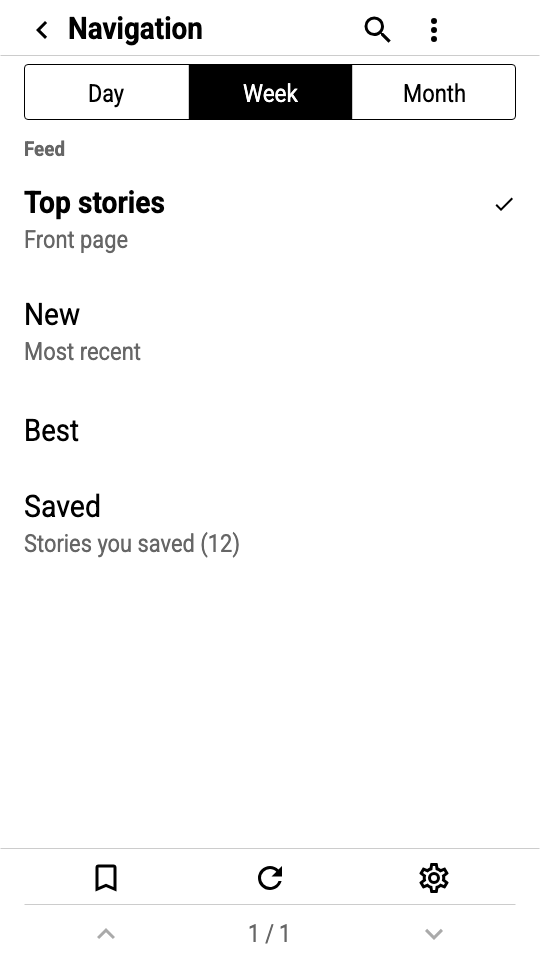
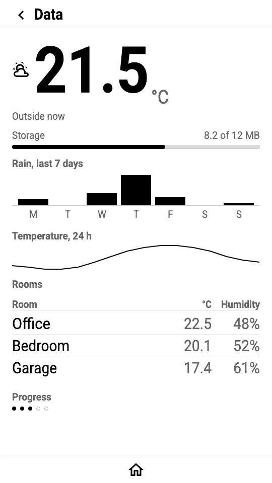
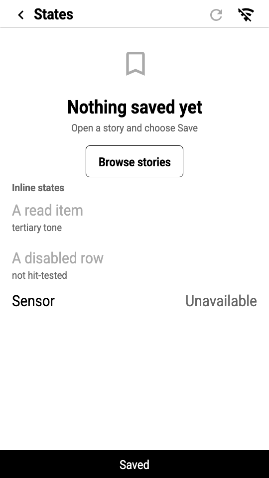
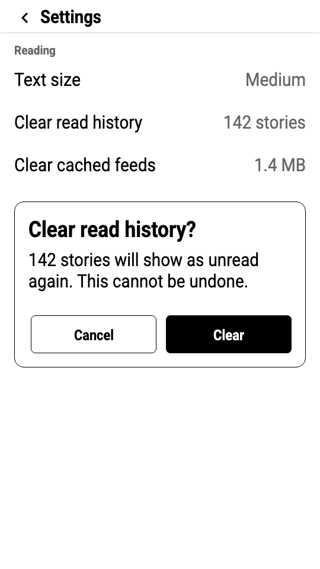
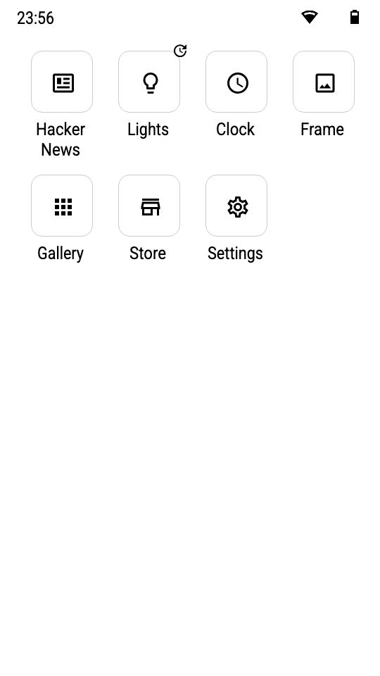
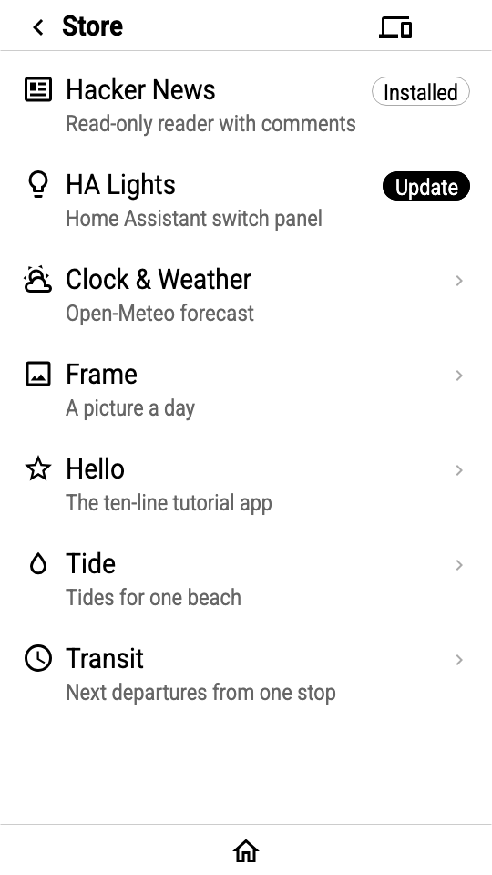
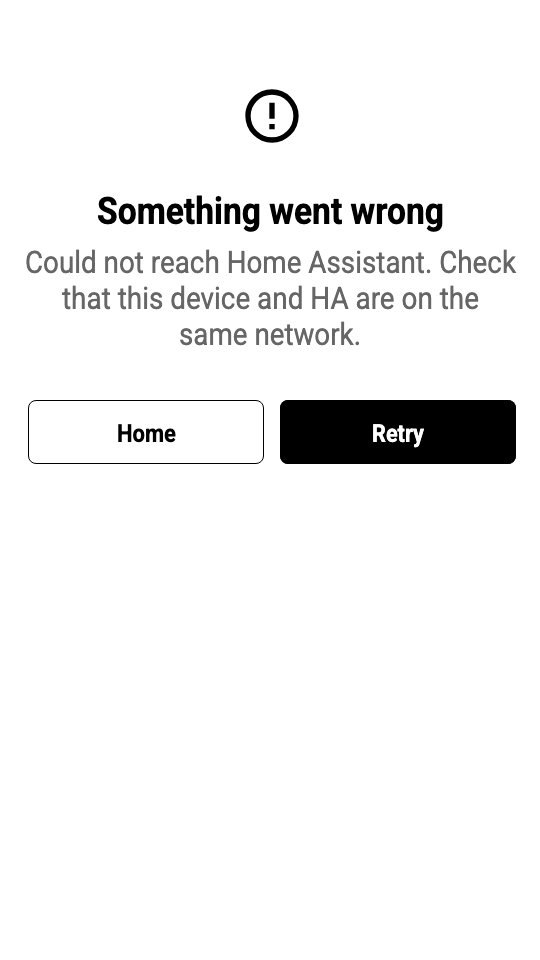
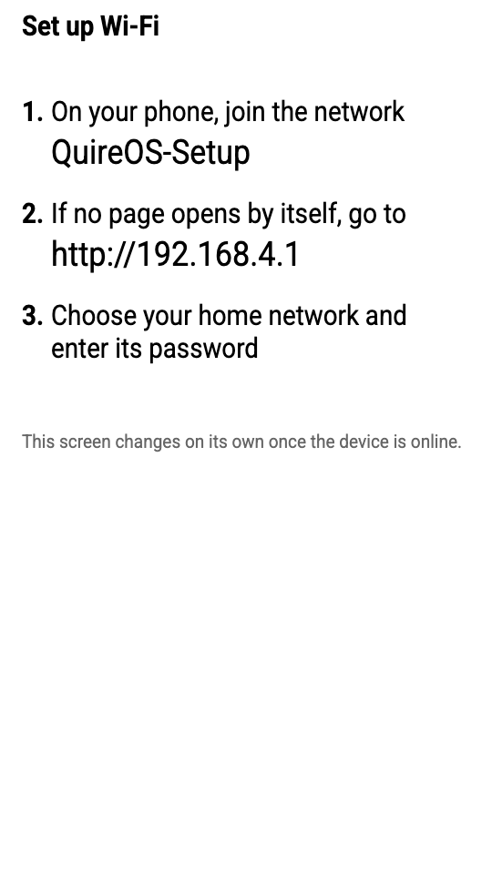
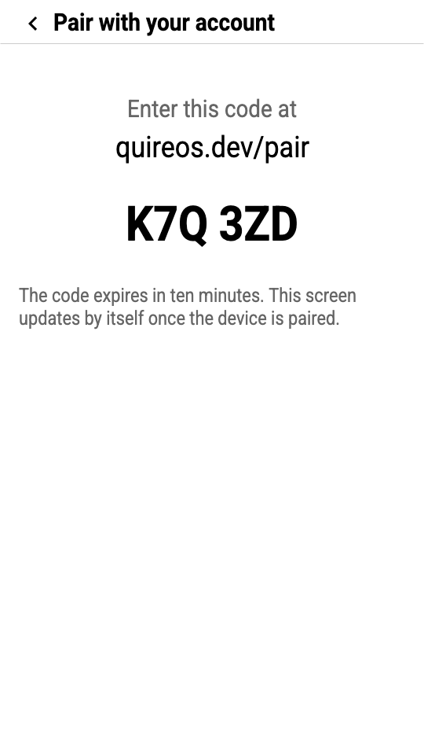

# Components

The QuireOS component library: what each part is for, how it is built from spec widgets, how it
behaves on every device class, and how to ask the kit for it. Sizes are t5pro pixels (540 × 960,
235 dpi) with millimetres where they matter; every other profile's values are in
[tokens/TOKENS.md](tokens/TOKENS.md). The rules behind the choices are in
[GUIDELINES.md](GUIDELINES.md). Every component is rendered for every profile in
[screens/](screens/) and can be viewed in [preview/index.html](preview/index.html).

The kit is `@quireos/ui` ([cloudflare/ui](../cloudflare/ui)). Every component returns a `Piece`:
the spec widgets plus the height it took, so pieces stack. Components that take a `Box`
(`{ x, y, w }`) flow; those that take `x, y` are placed.

```ts
import { kitFromRequest, Icons } from "@quireos/ui";
const ui = kitFromRequest(req);                       // profile from X-Screen
const screen = ui.page({
  id: "settings",
  nav: { title: "Settings", back: true },
  body: (frame) => ui.stack(frame, [
    (b) => ui.listRow(b, { title: "Theme", trailing: { value: "Light" }, on_tap: … }),
    (b) => ui.toggleRow(b, { title: "Frontlight", on: "vars.light == on", on_tap: … }),
  ], 0),
  toolbar: { rows: [[{ icon: Icons.home, on_tap: { type: "home" } }]] },
});
```

Contents: Foundations · System chrome · Navigation · Content · Controls · Overlays

<p align="center">
  
  
  
  
  
</p>

---

## Foundations

### Page

`ui.page({ id, nav?, toolbar?, body, overlay?, refresh?, ttl?, data?, vars?, keys? })` → `Screen`

The page owns the regions: nav bar at the top, toolbar at the bottom (or a rail on the left on
landscape screens), the content frame between them, the OS corner kept clear, overlays drawn
last. `body` receives the content frame; on t5pro portrait with a nav bar and one toolbar row the
frame is `{ x: 24, y: 64, w: 492, h: 832 }`.

Draw order is body, nav, toolbar, overlay. Z-order in the spec is array order, so an overlay
covers the chrome.

### Stack, pages and fit

`ui.stack(box, items, gap = space.gap)` lays pieces top to bottom, snapping each top to the unit.
Items are functions of a box (so a piece can measure itself) or `null` to skip. Use `gap 0` for
lists of rows (rows carry their own inset) and the default `8` for mixed content. `ui.spacer(h)`
inserts space; `space.group` (24) between groups, `space.section` (48) between sections.

`ui.paged(frame, items, { page })` lays out **only the items that fit**, and returns `pages` and
`page` alongside the widgets. Nothing scrolls on e-paper, so a list longer than its frame is broken
into pages of whole rows, the way body text is broken into pages of whole lines. A section header
that would be stranded at the foot of a page is carried to the next one. Lay the list out first so
the toolbar knows the page count, then assemble the page around it:

```ts
const f = ui.frame({ nav: true, toolbarRows: 1 });
const body = ui.paged(f, rows, { page });
return ui.page({
  id: page > 1 ? `feed-p${page}` : "feed",
  nav: { title: "Feed", back: true },
  toolbar: { rows: [ui.pagerRow({ page: body.page, pages: body.pages, prev: …, next: … })], placement: "bottom" },
  body: () => body,
});
```

`ui.fit(frame, variants)` lays out the first variant that fits, most ornate first. A notice that
has an icon, air and two supporting lines on a tablet keeps only its title and one line on a badge.
The built-in notices use it, which is how one implementation serves a 13-inch frame and a 2.9-inch
badge.

`ui.page()` measures the body against the frame and records `ui.overflow`; `ui.validate()` turns it
into an error and the gallery build fails on it. A screen that does not fit is a bug, not a
judgement call.

`ui.validate()` checks two things no spec validator can, because only a device knows them: that
nothing was laid out past the **frame**, and that nothing was laid out past the **glass**. The
first is precise but exists only when this kit built the page; the second reads the document, so it
still fires for a screen assembled by hand. A widget that overlaps an edge is clipped, which is
sometimes deliberate — a fill bleeding off the bottom, the toast band. One that **cannot intersect
the panel at all** can never be seen and is always a mistake. The test is intersection rather than
"starts past an edge", because a widget at `x = -200` with `w = 100` ends before the left edge and
is just as invisible.

The rule it holds to is **too quiet rather than wrong**: a widget is never larger than the size the
check estimates for it, so it can miss an invisible widget but can never fail a build over a
visible one. That applies to every input, not just the result, in three cases rather than two: a field the
document omits takes the spec's default (`md` for a size, one for `lines`), a field stated
literally is taken at its word, and only a field the device resolves at render time is unknown and
takes its maximum. Collapsing the first case into the third is sound and still blind — it stops
reporting every widget that did not state a size, which is most of them. A property test
generates a few thousand documents and asserts the rule as an equivalence: the check reports a
widget exactly when that widget cannot reach the panel. Its oracle is written from the spec's
defaults rather than from the implementation, because an oracle derived from the code agrees with
the code including its bugs, and it samples coordinates derived from the sizes themselves, so every
edge is crossed by one pixel in both directions. The same equivalence holds inside a grid, through a cell
offset. Nineteen mutations of the check were reintroduced to confirm the test catches each, since a
property test that passes the moment it is written is indistinguishable from one that tests
nothing.

Use `ui.validate()` rather than the standalone `validateScreen()`, which checks the spec alone.

`ui.columns(box, n, gap = space.gutter)` splits a box into equal columns on the unit; the remainder
goes to the outer edges. Pass `space.section` as the gap for columns of text (a right-aligned
value one gutter from the next column's key reads as one line); the default gutter is for tiles.
`ui.columnCount(w)` gives the number of `layout.min_column` (60 mm) columns that fit.

### Primitives

`ui.text`, `ui.rect`, `ui.hline`, `ui.vline`, `ui.icon`, `ui.target` are the spec widgets with
tokens applied: `text` takes a `role` (`display`, `title`, `headline`, `nav_title`, `row`, `body`,
`callout`, `label`, `section`, `caption`, `meta`) or explicit size/weight/tone; `rect` takes tone
names for fill and stroke; `target` is a transparent rectangle with `on_tap` and `feedback: invert`,
the hit area behind every custom control.

Geometry helpers: `ui.snap(v)` and `ui.snapUp(v)` round to the unit, `ui.snapRow(v)` to the rhythm
(2u), and `ui.centre(boxH, itemH)` centres one inside the other on the grid without going negative.

`ui.not(cond)` returns the opposite of a condition by flipping its comparison. The spec has no `!`,
so a widget that must appear only when a condition is **false** needs it — that is how a switch
draws an outlined knob when off and a filled one when on, instead of painting one over the other.

### The OS corner

`ui.cornerRect()` → `{ x: 468, y: 4, w: 48, h: 48 }` on t5pro portrait. The nav bar stops short of
it; `stack()` narrows any row that would run into it. Apps never draw there.

---

## System chrome

<p align="center">
  
  
  
  
  
</p>

OS-owned. Defined and rendered here so the launcher, store and built-in screens look like the
apps, and so the gallery can show them. Apps do not call these except `systemCorner` and `toast`
in previews.

### Status bar

`ui.statusBar({ title?, time? })` · height `chrome.status` 44 · launcher only

Left: the clock (`{{device.time|time:'HH:mm'}}`) or a title in `sm`. Right: Wi-Fi strength, a
charging bolt when charging, battery level, as `sm` icons 8 px apart. Levels are drawn as stepped
icons with `when` conditions, layered so the highest true step is on top (the device has no
arithmetic). No rule beneath: the launcher grid's own spacing separates them.

### OS corner glyphs

`ui.systemCorner({ glyph })` · `chrome.corner` 48 square at the top right

One `md` icon: `offline` (`wifi-off`), `error` (`alert-circle-outline`, a background refresh
failed), `update_available`, `charging`, `battery_low`, `busy` (`progress-clock`). One at a time,
in that priority.

### Launcher grid

`ui.launcherGrid(frame, { apps: [{ name, icon | { src }, on_tap, update? }] })`

A `grid` of app tiles: an `md` glyph (or the app's icon PNG) inside a rounded square of
`touch.recommended` (88), with the label `sm` centred beneath and the update glyph at the square's
top-right corner. The square is the point: a 24-unit glyph blown up to fill a cell turns its
strokes into slabs, so the icon stays at its drawn size and the container gives it presence. Labels
wrap to two lines when one will not fit. The whole cell is the target. Store and Settings are
ordinary tiles at the end.

### Store row

`ui.storeRow(box, { name, tagline, icon, installed?, update?, on_tap })`

A two-line list row with a leading `md` icon and a trailing pill: `Installed` outlined,
`Update` filled, else a chevron.

### Toast

`ui.toast({ text })` · `chrome.toast` 56 band at the bottom, full width, ink fill, paper label

The OS's transient message (`Saved`, `Could not refresh`). Cleared on the next render. Apps do
not draw toasts; a failure the app must report is an inline error line or the error screen.

### Notices: error, setup, needs setup, update OS, pairing

`ui.errorScreen({ message, retry?, home? })` · `ui.setupScreen({ ssid, url })` ·
`ui.needsSetupScreen({ app, url, home })` · `ui.updateOsScreen({ app, needs, has, url, home })` ·
`ui.pairingScreen({ code, url, cancel })` → each a whole `Screen`

The notice layout: `space.section` from the top, one `lg` icon centred, a `title` (xl bold) of at
most two lines, one or two `body` lines, an optional `callout` (a URL or code), then a button row
(`Home` secondary, `Retry` primary) filling the content width at `touch.min` height. Setup is a
numbered list instead of an icon. Pairing shows the code in `2xl` bold split in two groups.

---

## Navigation

### Nav bar

`ui.navBar({ title, back?, actions?, status? })` · height `chrome.nav` 56 (6 mm) · y 0

```
│‹  Lights                              ⟳  ⚙ │ ⚠ │   56
 ─────────────────────────────────────────────      1 px rule at y 55, content width
```

- **Back** (`chevron-left`, `md` 36) on the page margin; its hit area runs from the screen edge.
  `back: true` emits `{ type: "back" }`; pass an Action to override.
- **Title** `nav_title` (md **bold**), vertically centred, truncated by the device. The bold title
  is the page's anchor, which is what lets every row beneath it be set in the regular weight.
- **Actions** up to two icon cells, right to left, stopping 8 px before the OS corner.
- **Status** optional `meta` text right-aligned before the actions (`{{device.battery}}%`). Leave
  it out when the toolbar already carries a pager: saying `1 / 7` twice is chrome for its own sake.
- **Separator** a hairline under the bar, edge to edge. `bare: true` drops it.

Emits:

```json
[{"type":"rect","x":0,"y":0,"w":80,"h":56,"on_tap":{"type":"back"},"feedback":"invert"},
 {"type":"icon","x":24,"y":12,"name":"chevron-left"},
 {"type":"rect","x":404,"y":0,"w":56,"h":56,"on_tap":{"type":"refresh"},"feedback":"invert"},
 {"type":"icon","x":416,"y":12,"name":"refresh"},
 {"type":"text","x":68,"y":0,"w":336,"h":56,"text":"Lights","weight":"bold","valign":"middle"},
 {"type":"line","x1":0,"y1":55,"x2":539,"y2":55,"color":12}]
```

Do: one to three words. Don't: put the app name in every screen's title (the launcher knows
which app it opened); put more than two actions here (use the toolbar).

### Toolbar

`ui.toolbar({ rows: CellSpec[][], placement? })` · row height `chrome.toolbar` 56 · bottom

```
 ─────────────────────────────────────────────      hairline, edge to edge
      ▲            Top stories ▾           ▼       56 per row, equal cells, no dividers
```

One or two rows of equal cells inside the margins, with **no vertical dividers**: even spacing
already separates them, and a grid of boxed cells reads as a calculator. A cell is `{ icon }` or
`{ label }`, with
`on_tap`, optional `on_hold`, `disabled`, `plain` (a counter, not tappable), `menu` (label plus a
small chevron: it opens a menu), and `key` (`short` | `long` | `double`) for button-only devices.
Disabled cells draw at `tertiary`; on 1-bit panels the glyph is omitted instead. Remainder width
goes to the margins, never to the last cell.

On landscape screens (except badges) `page()` turns the toolbar into a **rail** unless
`placement: "bottom"`.

### Rail

`ui.rail({ cells, top })` · width `chrome.rail` 80 · left edge, from under the nav bar

The toolbar's cells stacked vertically, 56 each, with a hairline on the rail's right edge.
Content starts at `rail + margin`.

### Pager

`ui.pagerRow({ page, pages, prev, next })` → `CellSpec[]` for a toolbar row

`▲ · 2 / 9 · ▼`. Arrows dim (or vanish on 1-bit) where there is nowhere to go; the counter is
`plain`. Binds `long` = prev and `short` = next for button-only devices. On a reading page the
device also pages on a tap in the upper or lower half of the content, which the app implements
with two transparent targets.

### Segmented control

`ui.segmented(box, { segments: [{ label, on_tap, when? }], selected? })` · height `touch.row` 56

Two to four equal segments in a 1 px frame with `radius.sm`; the selected one is an ink fill with a
paper label. `selected` for server-side state, or a `when` condition per segment for var-driven
state (`vars.tab == day`). Labels are the `label` role (sm regular).

### Menu (choice list)

See Controls → Choice list. A menu of actions is an action sheet; a menu of destinations is a
list of link rows.

---

## Content

### Heading

`ui.heading(box, { text, role = "title", lines = 3, align? })`

Wrapped text in a role, at most `lines` lines (1–8), the last one ellipsised. `title` (xl bold)
for a screen's subject, `headline` (md bold) inside content, `caption` for a hint.

### List row

`ui.listRow(box, { title, subtitle?, meta?, leading?, trailing?, on_tap?, read?, disabled?, titleLines?, bold? })`

```
│ Title in the regular weight                    Value  › │   72 (1 line)
│ Title                                                   │
│ subtitle in sm, secondary                             ✓ │  104 (2 lines), 96 compact
│ meta · in xs · secondary                                │  136 (3 lines)
```

- **Height** `2 × row inset + text`, rounded up to the rhythm, then at least `touch.row` (56) when
  tappable. Inset is `space.4` (16) or `space.3` (12) in compact density
  (`createKit({ density: "compact" })`).
- **Weight** the title is **regular** by default. `bold: true` is for a row that differs from its
  neighbours; `bold` also takes a conditional so the device can bold the selected row itself.
- **Hit area** spans the screen edge to edge when the row spans the page, else the box.
- **Leading** an `md` icon, 12 px before the text.
- **Trailing** any of: `value` (body, secondary, right-aligned), `chevron` (tertiary), `check` (a
  condition or boolean), `icon`, `toggle`, `badge` (a count), `pill` (`{ text, filled? }`). Right to
  left, 8 px apart, 16 px from the text. Trailing furniture aligns with the **title line**, not the
  row's centre: a switch floating beside the gap under a two-line title is the single thing that
  makes a list look untended.
- **read** regular weight and tertiary tone. **disabled** tertiary tone, no hit area.
- Titles wrap to `titleLines` (1 by default, 3 in content lists); subtitle and meta are one line.

Emits (a settings row):

```json
[{"type":"rect","x":0,"y":64,"w":540,"h":72,"on_tap":{"type":"navigate","url":"/size.json"},"feedback":"invert"},
 {"type":"text","x":24,"y":84,"w":340,"text":"Text size"},
 {"type":"icon","x":492,"y":92,"name":"chevron-right","size":"sm","color":10},
 {"type":"text","x":380,"y":84,"w":104,"h":36,"text":"Medium","align":"right","valign":"middle","color":6}]
```

Do: stack rows with `gap 0`; separate groups with `space.group`. Don't: draw hairlines between
rows of one group; put an icon in front of every row.

### Link row

`ui.linkRow(box, { title, subtitle?, meta?, leading?, value?, on_tap })` — a list row with a
chevron: it navigates.

### Section header

`ui.sectionHeader(box, { text, trailing? })` · `section` role (xs bold, secondary) · height 32

A quiet label over a group of rows, with an optional right-aligned count. It is marked
`keepWithNext`, so `paged()` never leaves it stranded at the foot of a page. Never a rule under it.

### Divider

`ui.divider(box, { inset? })` · height `space.2` (8) with a hairline in the middle

For siblings that would otherwise touch. Between groups, use space instead.

### Card

`ui.card(box, { title?, body: (inner) => Piece, on_tap? })`

A 1 px ink frame (no radius, no fill) with `space.inset` (16) padding; an optional `headline`
title. Use for a self-contained item among other kinds of content (a weather summary above a
list). Not for every row of a list.

### Tile

`ui.tile({ x, y, w, h, label, sub?, icon?, on?, on_tap })` and
`ui.tileGrid(frame, { tiles, cols?, rows?, gap?, cellH? })`

```
┌──────────────┐  ┌──────────────┐
│ ◌            │  │ ●            │   a `button` widget: 2 px frame, radius 8,
│              │  │              │   icon above a centred headline label,
│  Pool lights │  │   Hallway    │   `sub` in xs at the bottom
│      OFF     │  │      ON      │   on = ink fill, paper text
└──────────────┘  └──────────────┘
```

A tile is one `button` widget, so the tap inverts exactly the tile. `on` is `true`/`false` or a
condition; the fill and the sub-label may be conditionals bound to a var, which is how a light
board updates optimistically. `tileGrid` uses the spec `grid`: on t5pro portrait two columns are
`238` wide; cell height fills the frame (`190` for four rows) and never goes under
`touch.recommended` (84).

Emits:

```json
{"type":"button","x":24,"y":64,"w":238,"h":190,"label":"Pool lights","icon":"lightbulb-outline",
 "sub":{"if":"vars.pool == on","then":"On","else":"Off"},
 "fill":{"if":"vars.pool == on","then":0,"else":15},
 "stroke":{"if":"vars.pool == on","then":0,"else":12},"stroke_w":1,"radius":8,
 "on_tap":{"type":"set","vars":{"pool":"off"}}}
```

An off tile is a hairline outline, an on tile is an ink fill with an ink edge: the board reads at a
glance as "these three are on" rather than as a grid of boxes.

### Stat

`ui.stat(box, { value, unit?, label?, icon?, numeric?, size?, align? })`

```
21.5 °C          digits (150) bold + lg unit, bottom-aligned
Outside          xs caption, 8 below
```

The one number a panel exists to show. Digits-only values use the `digits` face; anything else
falls back to `3xl`. `size: "2xl"` for a secondary stat. One `display`-size stat per screen.

Emits: three `text` widgets (`digits` value with `valign: bottom`, `lg` unit, `xs` label).

### Key–value row

`ui.keyValue(box, { key, value, on_tap? })` · height `lh(md) + 8` = 44, or a list row when tappable

Key in `body` at the left, value in `body` secondary right-aligned. For read-only facts:
battery, addresses, times. Stack with `gap 0`.

### Paragraph, paginate, text lines

`ui.paragraph(box, { text, size = "md", maxLines?, paraGap = space.3 })` · `ui.paginate(w, h, { text, size })` ·
`ui.textLines(box, { lines, size })`

Body text. Blank lines separate paragraphs (`space.3`, a third of a line, between them). Each
paragraph becomes `text` widgets of at most eight lines (`lines: n`), wrapped with the same
algorithm the device uses, so nothing re-flows on the glass. `paginate` returns page strings for
a box, breaking only between whole lines; render each with `paragraph`. Reading size is an app
setting: `sm`, `md` or `lg`.

### Meta line

`ui.metaLine(box, { facts, size = "xs" })` · height 24 · secondary tone

`675 pts · 273 comments · 1 d · example.com`. Whole facts are dropped from the end until the
line fits; a fact is never cut.

### Pill and badge

`ui.pill({ x, y, text, filled?, icon? })` · height `space.8` 32, radius 16, 1 px stroke, `label` text
`ui.badge({ x, y, count })` · height 24, ink fill, xs bold paper count

A pill is a status word (`Installed`, `Update`, `Offline`); filled means it needs attention. A
badge is a count. Both are inline pieces (they return `w`), usually as a row's trailing item.

### Progress and steps

`ui.progress(box, { value: 0..1, h = space.3, label? })` · `ui.steps(box, { count, current })`

A 1 px outlined track with an ink fill to the fraction. Steps are 8 px dots, filled up to the
current one. Neither animates: they show a fraction that was true when the screen was made.

### Bar chart and sparkline

`ui.barChart(box, { values, max?, h = 128, labels?, outline? })` · `ui.sparkline(box, { values, h = 64 })`

Bars are ink `rect`s on the unit with a rule as the baseline; labels `meta` under each bar.
A sparkline is `line` segments, 2 px, at most 40 points (longer series are resampled). Two
series are told apart by `outline`, never by grey.

### Table

`ui.table(box, { columns: [{ title, w?, align? }], rows, header?, compact? })`

Header in the `section` role with a rule beneath; rows in `body` with hairlines between; numeric
columns `align: "right"` and set in the secondary tone. **A column without `w` is measured from its
widest cell**, and the leftover width goes to the first column, so numbers are never truncated —
`2…` where `22.5` was meant is the fastest way to make a table look broken. A table is read, not
tapped; for tappable rows use list rows.

### Image

`ui.imageBlock(box, { src, w?, h, caption?, ttl? })`

The `image` widget plus a caption. The PNG must be exactly `w × h`, greyscale, pre-dithered for
the profile that asked (the app knows it from `X-Screen`). Two per screen at most; the page should
set `refresh: "full"`.

### Empty state

`ui.emptyState(box, { icon, title, hint?, action? })`

`space.section` from the top: a `lg` icon, a `headline` title, a `caption` hint and one
secondary button, all centred. The only centred text outside controls. Never a blank content
region.

### Battery and Wi-Fi glyphs

`ui.batteryGlyph({ x, y, value, size? })` · `ui.wifiGlyph({ x, y, rssi, online?, size? })`

A literal number picks one icon; a template path (`device.battery`) emits the stepped set with
`when` ranges, layered low to high.

---

## Controls

### Button

`ui.button({ x, y, w?, label, kind = "secondary", size = "md", icon?, sub?, on_tap, disabled? })` ·
`ui.buttonRow(box, { buttons, align = "fill", size? })`

| kind | fill | stroke | text |
|---|---|---|---|
| primary | ink | ink, 1 px | paper |
| secondary | paper | ink, 1 px | ink |
| tertiary | none | none | ink |
| disabled | paper | tertiary, 1 px | tertiary; not hit-tested |

| size | height | label |
|---|---|---|
| `sm` | `touch.row` 56 | sm bold |
| `md` | `touch.min` 64 | sm bold |
| `lg` | `touch.recommended` 84 | md bold |

Radius `radius.md` 8. Width is measured (label + 48 padding) unless given; `buttonRow` with
`align: "fill"` shares the box, which is how dialogs and notices lay out `Cancel · Save`. One
primary per screen.

The spec's `button` widget draws its `icon` **above** its label — that is the tile shape. A button
with an icon **beside** its label is therefore composed by the kit from a tappable rounded rect
with the glyph and label laid on it. Tap feedback inverts the rect, which covers both, so it still
reads and behaves as one control.

Emits a single `button` widget:

```json
{"type":"button","x":24,"y":64,"w":84,"h":68,"label":"Save","size":"sm","radius":8,"fill":0,"stroke":0,"color":15,"on_tap":{"type":"refresh"}}
```

### Icon button

`ui.iconButton({ x, y, icon, on_tap, framed?, disabled? })` · `touch.row` square (56)

An `md` icon in a transparent target, or in a 2 px frame when `framed`. Nav bars and toolbars
make their own; this one is for content (a stepper's `−` and `+`).

### Toggle

`ui.toggle({ x, y, on, on_tap? })` · 64 × 32 pill · `ui.toggleRow(box, { title, subtitle?, on, on_tap })`

```
(○    )  Off        (    ●)  On
```

A 1 px pill track: outlined with an outlined knob at the left when off, ink-filled with a paper
knob at the right when on. Off is an outline rather than a filled dot, so a column of switches
reads as quiet shapes with the on ones standing out.

Each knob is drawn only in its own state, which needs `ui.not()` on the on-condition. Where the
condition cannot be inverted (a bare truthiness test) the knobs fall back to painting over each
other, which is correct but heavier.

`toggleRow` is a list row whose whole width toggles. It shows `On`/`Off` as the trailing value as
well; pass `value: false` to drop the word on a grey panel, where the pill alone is clear enough.

Emits:

```json
[{"type":"rect","x":424,"y":64,"w":64,"h":32,"fill":{"if":"vars.hall == on","then":0,"else":15},"stroke":0,"stroke_w":1,"radius":16},
 {"type":"rect","x":428,"y":68,"w":24,"h":24,"fill":15,"stroke":0,"stroke_w":1,"radius":12,"when":"vars.hall != on"},
 {"type":"rect","x":460,"y":68,"w":24,"h":24,"fill":15,"radius":12,"when":"vars.hall == on"}]
```

### Checkbox row

`ui.checkboxRow(box, { title, subtitle?, checked, on_tap })`

A list row with a leading `checkbox-blank-outline`, and `checkbox-marked` drawn over it when
checked (a condition or boolean). Multi-select lists; for one-of-many use a choice list.

### Choice list

`ui.choiceList(box, { options: [{ label, sub?, value }], selected? | selectedPath?, on_select })`

Rows where the current one is bold with a check mark at the right. `selectedPath` (`vars.feed`)
makes the check and the weight conditionals, so `set` actions update the list without a round
trip. This is the Categories menu of the Hacker News reader and every settings picker.

### Stepper

`ui.stepper(box, { label, value, on_dec, on_inc, min?, max? })` · height 56

`Frontlight        [−]  3  [+]`: a label, then framed icon buttons around a `lg` value. `min`
and `max` disable the matching button. Use for small integer settings; for a range with more than
about ten steps use a slider.

### Chips

`ui.chips(box, { chips: [{ label, selected?, on_tap, icon? }] })` · chip height 56, radius 28

Choice chips wrapping into rows, 8 apart. Selected chips fill. Feeds, filters, tags.

### Slider

`ui.slider(box, { steps, value, on_set, label? })` · height 56

Discrete only: `steps` tappable segments 4 px apart, filled up to `value`, a 12 px bar in a 56 px
target. There is no dragging on e-paper; a slider is a row of taps.

### Keypad

`ui.keypad(box, { on_key, on_delete?, on_ok?, display? })`

The only text input on a device: a `2xl` right-aligned display and a `grid` of twelve
`button`s (`1`–`9`, backspace, `0`, check) at `touch.recommended` height. PINs, codes, quantities.
Everything else is typed on the LAN settings page.

---

## Overlays

Pass to `page({ overlay })`; drawn last.

### Dialog

`ui.dialog({ title, message?, primary, secondary? })`

A paper card the content width, centred vertically, 2 px ink frame, `space.6` (24) padding: a
`headline` title (≤ 2 lines), a `body` message (≤ 6), then `Cancel · Confirm` as a filled button
row at `touch.min`. For confirmations that cannot be undone. There is no scrim: the frame and the
paper fill are the modality.

### Action sheet

`ui.actionSheet({ title?, items: [{ label, icon?, on_tap, destructive? }], cancel? })`

A paper band from the bottom with a 2 px rule on top: centred `body` rows of `touch.min` height,
an optional `meta` title, and a bold `Cancel` row after a hairline. For "more" menus from a nav
action.

---

## Which component for what

| need | component |
|---|---|
| go somewhere | link row, nav action, toolbar cell |
| choose one of few | segmented control |
| choose one of many | choice list |
| choose several | checkbox rows, chips |
| turn a thing on or off | toggle row, tile |
| set a small number | stepper; slider above ~10 steps |
| enter a code | keypad |
| confirm something irreversible | dialog |
| more actions than fit | action sheet |
| show one number | stat |
| show many numbers | key–value rows, table |
| show a trend | sparkline, bar chart |
| show progress | progress, steps |
| show a status word | pill; badge for a count |
| nothing to show | empty state |
| something failed while working | inline error line (key–value with the message) |
| something failed on open | the OS error screen |
