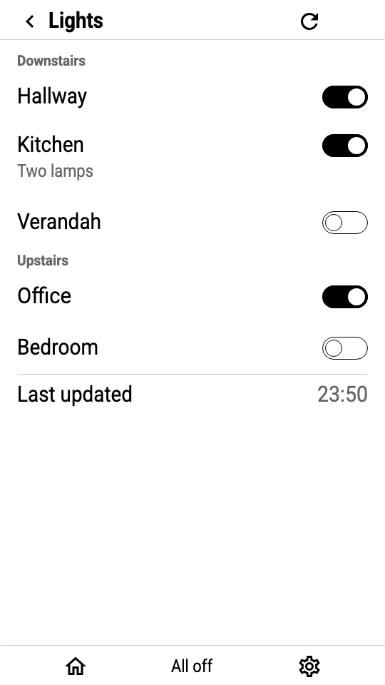
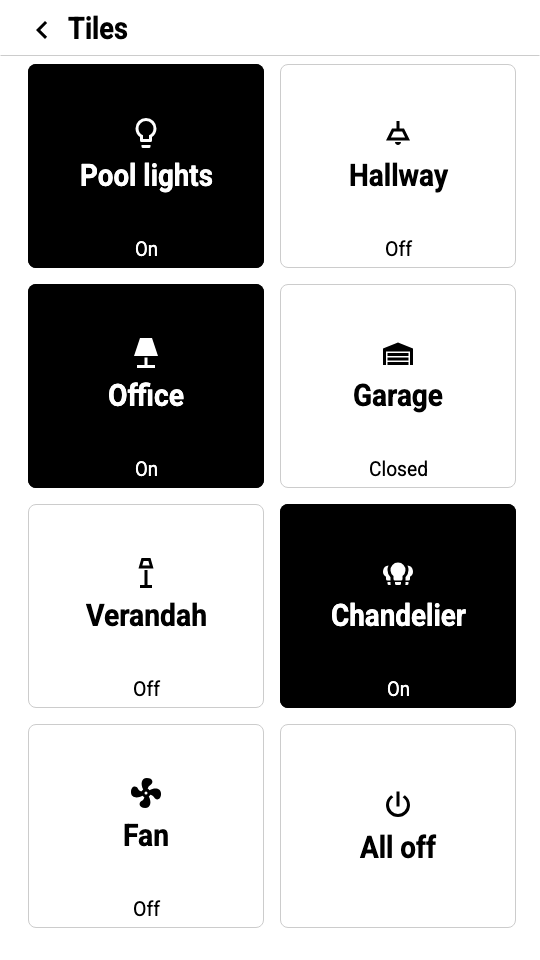
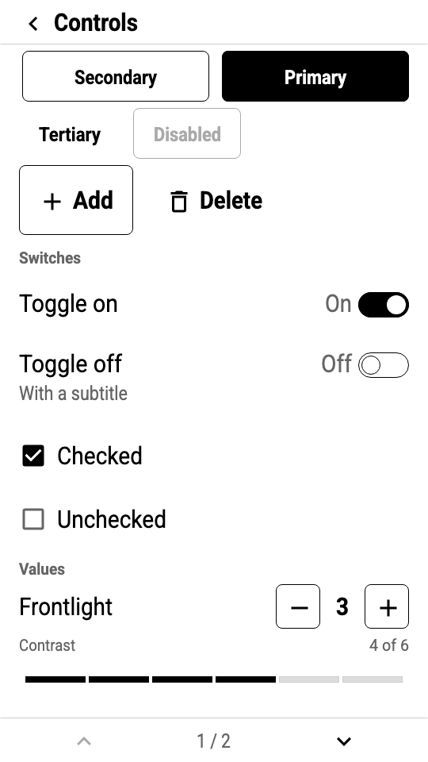
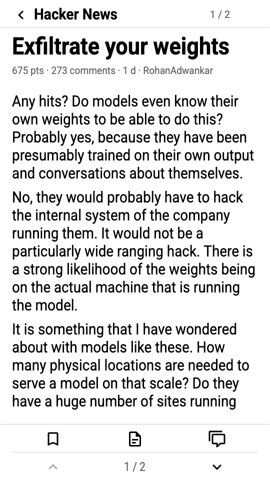
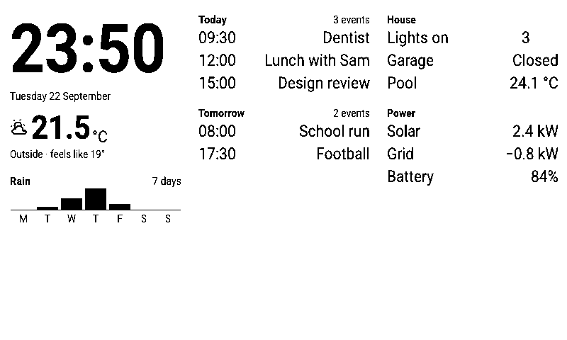
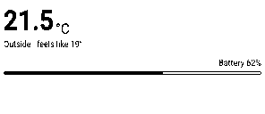

# QuireOS design system

The equivalent of a platform's human interface guidelines plus its standard controls, for e-paper.
It says what every QuireOS screen has in common, gives the numbers, and ships the parts.

| | Where | What it is |
|---|---|---|
| Guidelines | [GUIDELINES.md](GUIDELINES.md) | Principles, device classes, layout, **space**, type, tone, icons, refresh, input, states, writing |
| Components | [COMPONENTS.md](COMPONENTS.md) | Every component: anatomy, variants, states, sizes per profile, the JSON it becomes, the kit call |
| Tokens | [tokens/TOKENS.md](tokens/TOKENS.md) · [tokens/tokens.json](tokens/tokens.json) | Pixel values per device profile, generated from [profiles.json](profiles.json) by `tokens/build.mjs` |
| Icons | [icons/ICONS.md](icons/ICONS.md) · [icons/icons.json](icons/icons.json) | The icon library (294 Material Design Icons, tiered), rules, and the list the firmware compiles |
| Kit | [`cloudflare/ui`](../cloudflare/ui) (`@quireos/ui`) | TypeScript builders that turn components into spec widgets for any profile |
| Gallery | [`cloudflare/apps/gallery`](../cloudflare/apps/gallery) | The starter template: an app showing every component, laid out for whatever device asks |
| Reference screens | [screens/](screens/) | Generated from the gallery for every profile and orientation; the visual spec and validator fixtures |
| Emulator | [preview/index.html](preview/index.html) | Open in a browser: every screen on every profile, tappable, with history, vars, button presses and 1-bit to 16-grey |
| Proposals | [PROPOSALS.md](PROPOSALS.md) | Small spec and tooling changes the system asks of the OS |

<p align="center">
  
  
  
  
</p>
<p align="center">
  
  
</p>
<p align="center"><sub>The same components on a 4.7-inch handheld, a 7.5-inch 1-bit panel and a 2.9-inch badge. More in <a href="screenshots/">screenshots/</a>.</sub></p>

## What is fixed and what is free

QuireOS apps own their whole screen, so the system does not force a look on them the way a window
manager would. It fixes the things a person's hand and eye learn once and expect everywhere, and
leaves composition to the app.

**Fixed (use the tokens and components; the store's validator will warn on deviations):**

- Physical sizes: touch targets, type sizes, icon sizes, chrome heights. They are millimetres per
  device class, so a button is the same size under a finger on every panel.
- The page: margins, the nav bar and toolbar shapes, the top-right **OS corner** that the OS draws
  into, the toast band.
- Tone: the ink-level scale and what each level means; the dark theme is an inversion, never a
  restyle.
- States: tap inverts, selected fills, disabled is 40 % ink or absent, on/selected uses the filled
  icon twin. Never meaning in grey alone.
- The icon family and the type family.
- Refresh manners: no animation, no blanking, `full` for image screens.
- **Fit**: nothing scrolls and nothing is clipped. A screen that overruns its frame fails the build.
- Writing: sentence case, digits, short.

**Free:**

- What goes on a screen, in what order, at what density (within the space rules).
- Which components, or none: an app may draw entirely with primitives if it keeps the fixed rules.
- Imagery: any PNG the app hosts, pre-dithered for the device that asked.
- Its own icon, name and voice.

## Using it

```ts
import { kitFromRequest, Icons } from "@quireos/ui";
import { json } from "@quireos/sdk";

export default {
  async fetch(req: Request) {
    const ui = kitFromRequest(req);            // reads X-Screen, picks the profile
    const screen = ui.page({
      id: "home",
      nav: { title: "Lights" },
      body: (f) => ui.tileGrid(f, { cols: 2, tiles: [{ label: "Pool", on: "vars.pool == on", on_tap: … }] }),
      toolbar: { rows: [[{ icon: Icons.refresh, on_tap: { type: "refresh" } }]] },
    });
    return json(screen, req);                  // canonical JSON, strong ETag, 304 when unchanged
  },
};
```

The kit returns plain spec JSON; there is nothing to install on the device. Copy
`cloudflare/apps/gallery` to start an app with every component already wired, or
`cloudflare/apps/_template` for the bare minimum.

## Regenerating

```bash
node design/tokens/build.mjs            # tokens.json, TOKENS.md
(cd design/icons && npm install && npm run build)   # icons.json, paths.json, names.txt, sheet.svg
(cd cloudflare && npm run build -w apps/gallery)     # design/screens/**, design/preview/data.js
```

Sizes are derived from millimetres per device class, and the firmware generates its font tables from
those derived line heights. The token build cross-checks **every** profile against
`spec/fonts.json` and fails on any drift, so the pixels in this system and the pixels the device
compiles cannot disagree.
