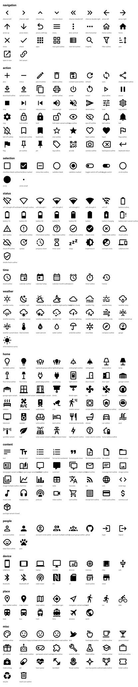

# Icons

QuireOS draws icons from a fixed set compiled into the firmware: [Material Design Icons](https://pictogrammers.com/library/mdi/)
by Pictogrammers (Apache-2.0), pinned to the `@mdi/svg` version in [icons.json](icons.json). A screen
names an icon (`{ "type": "icon", "name": "lightbulb-outline" }`) and the device draws it; apps never
ship glyphs. Anything not in this set is drawn with an `image` widget (a PNG the app hosts).

- **vocab.json** is the hand-written vocabulary: name, semantic role, category, and the filled twin.
- **icons.json**, **paths.json**, **names.txt** and **sheet.svg** are generated by `npm run build`
  here. `names.txt` is the list `firmware/tools/gen_icons.py` should compile.
- The kit exposes every role as a constant (`Icons.back === "chevron-left"`) so apps do not
  hard-code MDI names.

## Sizes

Three sizes per profile, from [tokens](../tokens/TOKENS.md). Use them for what they are named for:

| size | t5pro | use |
|---|---|---|
| `sm` | 24 px (2.6 mm) | inline with `xs`/`sm` text: list-row trailing glyphs, chips, the status bar |
| `md` | 36 px (3.9 mm) | chrome and controls: nav bar, toolbar, rail, tiles, buttons, launcher, the OS corner |
| `lg` | 64 px (6.9 mm) | one per screen: empty states and notices |

**An icon is the size of the text beside it.** `md` matches the `md` line box, which is why chrome
set at `md` sits level with its labels. These glyphs are drawn on a 24-unit grid, and a 24-unit
drawing keeps its stroke weight only to about 3× scale; past that the strokes thicken into slabs
and the chrome shouts over the content. That is the reason `lg` is 64 and not 96, and the reason a
launcher draws a `md` glyph inside a rounded square instead of one enormous glyph.

Never scale an icon by drawing it in a box of another size; pick the size. An icon always sits on
the unit grid and is vertically centred on the text or control beside it (its box is centred on the
line box, not on the baseline).

## Tiers

Flash is finite. `icons.json` tags each icon:

- **core** (238): compiled into every firmware at `sm` and `md`. Navigation, actions, selection,
  status, time, weather, home and content, plus the handful of icons the OS draws on its own
  screens — the launcher's Store tile, the pairing screen, the account rows — which live in
  otherwise-extended categories. A firmware that cannot draw its own Store tile is not a firmware,
  so those are core wherever their category sits.
- **extended** (56): people, places, misc, and the devices the OS does not itself need. Compiled
  where a board's flash allows. An app that wants one elsewhere uses a core icon or its own PNG.
- **display** (44): also compiled at `lg`. Only these may be a screen's single large glyph.

On t5pro that is **305 kB** of bitmaps for core at `sm` and `md` plus display at `lg`, against
561 kB before the sizes were pinned to the text.

The firmware compiles this list, so an icon outside it draws nothing on glass. `@quireos/ui` and
the SDK both validate against what is actually compiled: a name in the library but outside the tier
reads "not compiled into this firmware; use a core icon or a PNG", and a name that is not an icon
at all reads "unknown icon". Both are build errors rather than warnings, because a screen that
ships a blank where a glyph belongs is worse than a build that stops. The sizes come from each profile's tokens, so a board with a
different dpi gets its own.

## Style rules

1. **Outline is the resting state; filled is on, selected or saved.** Pairs are declared in
   `icons.json` (`bookmark-outline` ↔ `bookmark`, `lightbulb-outline` ↔ `lightbulb`). Use exactly
   the pair; never invent a third state with grey. On 1-bit panels this is the only way state reads.
2. **One family.** MDI only. Do not mix in glyphs from another set, emoji, or hand-drawn shapes,
   even as a PNG. The one exception is an app's own icon (a 96 × 96 PNG per the manifest).
3. **Icons label actions, not decoration.** A toolbar cell is an icon; a list row leads with text.
   Do not put an icon in front of every row of a list to make it feel richer.
4. **An icon alone must be unambiguous, or it gets a label.** Back, close, settings, refresh, add
   and the arrows are understood alone. Everything else pairs with a `label`, or is a text button.
5. **Ink only.** Icons draw at `tone.ink` (or `tone.paper` on an inverted fill). `secondary` only
   for a disabled control's icon on 16-grey panels; on 1-bit, disabled icons are simply absent.
6. **Never rotate or mirror** an icon to mean something else; use the icon that means it
   (`chevron-left` not a rotated `chevron-up`; `arrow-u-left-top` for undo).
7. **The OS corner uses these and nothing else:** `wifi-off` (offline), `alert-circle-outline`
   (a background refresh failed), `update` (app or OS update available), `battery-charging`,
   `battery-alert-variant-outline` (low), `progress-clock` (busy). Apps do not draw them anywhere.

## Battery and signal

The status roles come in steps so a glyph can be chosen from a number without arithmetic on the
device (there is none): `battery_0..100` in 0/10/30/50/70/90/100 and `wifi_0..4`. The kit picks the
step for a value; on screens it renders as a template conditional, one `when` per step.

## Adding an icon

Add an entry to `vocab.json` (name must exist in `@mdi/svg`, the role must be unique), run
`npm run build`, and hand `names.txt` to the firmware. Adding an icon is additive and needs no
`spec_version` bump; apps that rely on it set `min_os` to the first OS that compiled it.
